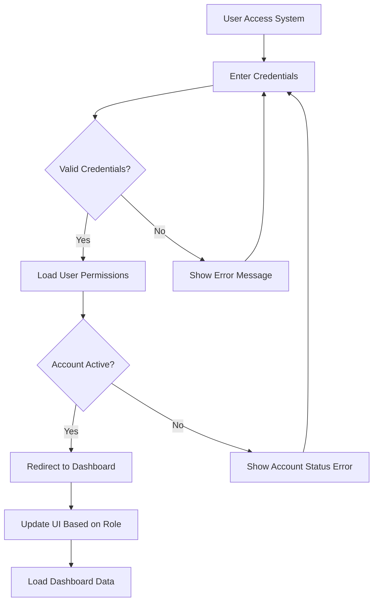
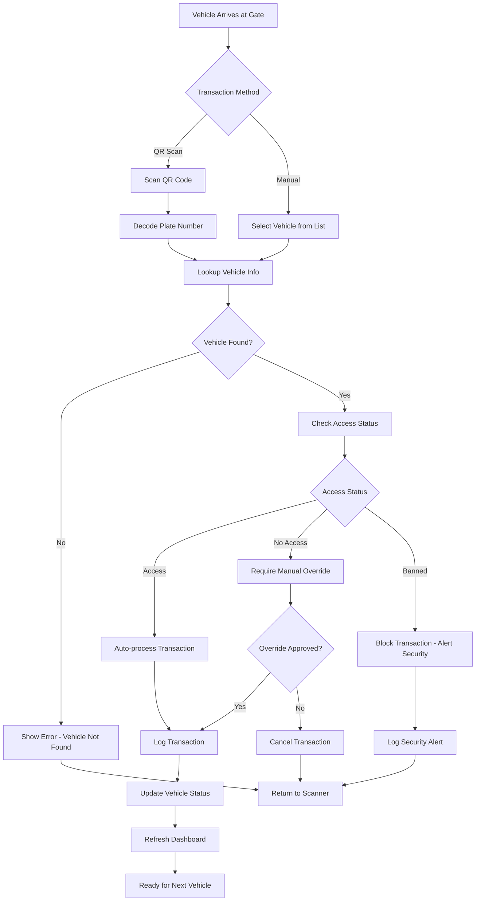
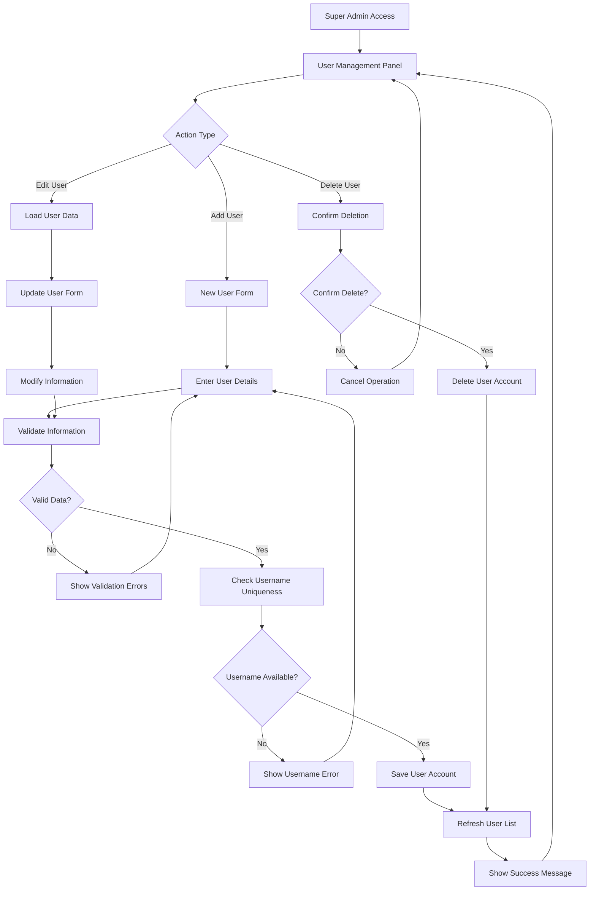
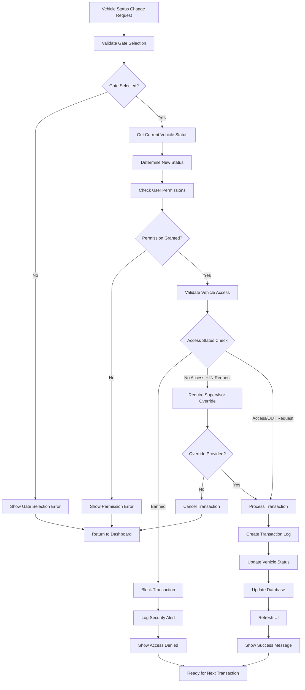
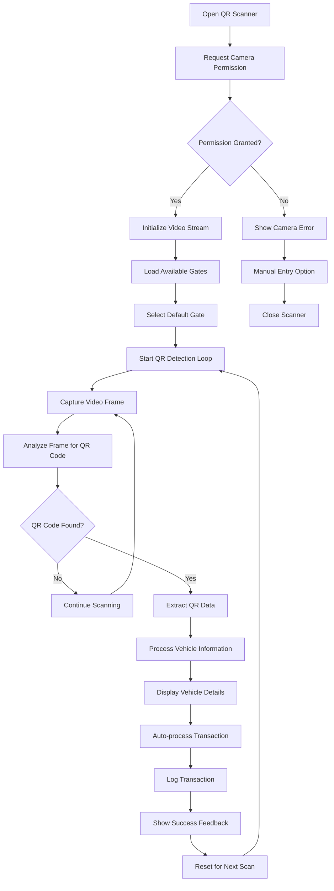

# Vehicle Monitoring System - User Manual

## Table of Contents
1. [System Overview](#system-overview)
2. [Getting Started](#getting-started)
3. [User Roles and Permissions](#user-roles-and-permissions)
4. [System Workflows](#system-workflows)
5. [Feature Documentation](#feature-documentation)
6. [Flow Charts](#flow-charts)
7. [Troubleshooting](#troubleshooting)
8. [FAQ](#faq)

---

## System Overview

The Vehicle Monitoring System is a comprehensive web-based application designed to track and manage vehicle access at organizational premises. The system provides real-time monitoring of vehicle entry/exit transactions, user management, and access control features.

### Key Features
- **Real-time Vehicle Tracking**: Monitor vehicle IN/OUT status
- **QR Code Scanner**: Quick vehicle identification and transaction logging
- **Role-based Access Control**: Security, Admin, and Super Admin roles
- **Gate Management**: Multi-gate support with customizable access points
- **Transaction Logging**: Complete audit trail of all vehicle activities
- **Responsive Design**: Works on desktop, tablet, and mobile devices
- **Fullscreen Mode**: Enhanced viewing experience for security stations

### System Architecture
- **Frontend**: HTML5, CSS3, Bootstrap 5, JavaScript
- **Backend**: Google Apps Script
- **Database**: Google Sheets
- **Authentication**: Session-based with role management

---

## Getting Started

### System Requirements
- Modern web browser (Chrome, Firefox, Safari, Edge)
- Internet connection
- Camera access (for QR code scanning)
- Valid user account

### Initial Login
1. Navigate to the system URL
2. Enter your username and password
3. Click "Sign In"
4. Upon successful authentication, you'll be redirected to the dashboard

### Dashboard Overview
The main dashboard displays:
- **Statistics Cards**: Total vehicles, vehicles IN, vehicles OUT
- **Quick Summary**: Last update time, active gate, today's activity
- **Vehicle List**: Searchable table of all vehicles
- **Transaction Logs**: Recent activity feed

---

## User Roles and Permissions

### Role Hierarchy

#### Super Admin
- **Full System Access**
- Create, edit, delete users
- Manage gates and access points
- Full vehicle management
- System configuration
- View all reports and logs

#### Admin
- **Vehicle Management**
- Add, edit vehicles
- Change vehicle status
- View all vehicles and transactions
- Limited user management (cannot manage Super Admins)

#### Security
- **Gate Operations**
- QR code scanning
- Vehicle IN/OUT transactions
- View assigned vehicles
- Update current driver information

### Permissions Matrix

| Feature | Super Admin | Admin | Security |
|---------|-------------|-------|----------|
| User Management | ✅ Full | ✅ Limited | ❌ |
| Vehicle Management | ✅ Full | ✅ Full | ✅ Driver Only |
| Gate Management | ✅ Full | ❌ | ❌ |
| QR Scanning | ✅ | ✅ | ✅ |
| Transaction Logs | ✅ Full | ✅ Full | ✅ Limited |
| Reports & Statistics | ✅ | ✅ | ✅ Limited |

---

## System Workflows

### Login Process
```
User enters credentials → System validates → Role permissions loaded → Dashboard displayed
```

### Vehicle Transaction Process
```
Vehicle arrives → QR scan or Manual transction → System validation → Transaction logged → Vehicle Status updated
```

### User Management Process
```
Super Admin → User Management → Add/Edit User → Role assignment → Save → Email notification (optional)
```

---

## Feature Documentation

### 1. Vehicle Management

#### Adding a New Vehicle
1. Click the "+" floating action button or "Manage Vehicles" in the navbar
2. Fill in the required fields:
   - **Plate Number** (Required)
   - **Make/Model** (Required)
   - Color, Department, Year, Type
   - Current Driver
   - Assigned Drivers (comma-separated)
   - Access Status (Access/No Access/Banned)
3. Click "Add Vehicle"

#### Editing Vehicle Information
1. Click "Details" on any vehicle in the list
2. Click "Edit" in the modal
3. Modify the information
4. Click "Save Changes"

**Note**: Security role users can only edit the current driver field.

#### Vehicle Status Management
- **IN**: Vehicle is currently on premises
- **OUT**: Vehicle is currently off premises
- Status changes are logged with timestamp, gate, and user information

### 2. QR Code Scanner

#### Setting Up QR Scanner
1. Click the QR scanner floating action button
2. Allow camera access when prompted
3. Select the gate from the dropdown
4. Choose front or back camera
5. Click "Start Scanning"

#### Scanning Process
1. Position QR code within the scanning frame
2. System automatically detects and processes the code
3. Vehicle information is displayed
4. Transaction is automatically logged for vehicles with access
5. Manual confirmation required for restricted vehicles

#### Scanner Features
- **Auto-processing**: Vehicles with access are automatically processed
- **Access Control**: Banned/No Access vehicles require manual override
- **Continuous Scanning**: Quick processing of multiple vehicles
- **Camera Selection**: Switch between front/back camera

### 3. User Management (Super Admin Only)

#### Adding Users
1. Navigate to User Management
2. Click "Add User"
3. Fill in user details:
   - Username (unique)
   - Full Name
   - Email
   - Role (Security/Admin/Super Admin)
   - Password
   - Status (Active/Inactive/Suspended)
4. Click "Save User"

#### Managing User Accounts
- **Edit Users**: Update user information and roles
- **Password Reset**: Change user passwords
- **Account Status**: Activate, deactivate, or suspend accounts
- **Role Changes**: Modify user permissions

### 4. Gate Management (Super Admin Only)

#### Adding Gates
1. Go to "Manage Gates"
2. Click "Add Gate"
3. Enter gate name
4. Save

#### Gate Operations
- Gates are used for transaction logging
- Each transaction is associated with a specific gate
- Gates can be edited or deleted
- Active gates appear in all gate selection dropdowns

### 5. Search and Filtering

#### Search Capabilities
Search across multiple fields:
- Plate number
- Make/Model
- Department
- Current driver
- Assigned drivers

#### Filter Options
- **Status Filter**: IN/OUT vehicles
- **Access Filter**: Access/No Access/Banned vehicles
- **Gate Filter**: Transactions by specific gate

#### Advanced Features
- **Real-time Search**: Results update as you type
- **Clear Filters**: Reset all search criteria
- **Pagination**: Handle large datasets efficiently

### 6. Fullscreen Mode

#### Activating Fullscreen
- Press `Ctrl+F` or click the fullscreen button
- Optimized layout for security stations
- Auto-hiding navigation bar

#### Fullscreen Features
- **Focus Mode** (`F` key): Dim statistics, highlight main content
- **Zen Mode** (`Z` key): Minimal UI for maximum focus
- **Keyboard Shortcuts**: Quick navigation and refresh (`R` key)
- **Enhanced Performance**: Optimized for continuous monitoring

---

## Flow Charts

### 1. User Authentication Flow



### 2. Vehicle Transaction Flow



### 3. User Management Flow



### 4. Vehicle Status Update Flow



### 5. QR Scanner Initialization Flow



---

## Troubleshooting

### Common Issues

#### Login Problems
**Issue**: Cannot log in with correct credentials
**Solutions**:
1. Check if account is active
2. Verify username spelling
3. Ensure password is correct
4. Check if account is suspended
5. Contact system administrator

#### QR Scanner Not Working
**Issue**: Camera not accessible or QR codes not detected
**Solutions**:
1. Allow camera permissions in browser
2. Check if camera is being used by another application
3. Try switching between front/back camera
4. Ensure QR code contains valid vehicle plate number
5. Refresh the page and try again

#### Vehicle Not Found
**Issue**: QR scan or search doesn't find vehicle
**Solutions**:
1. Verify plate number is correctly entered in system
2. Check if vehicle is spelled correctly
3. Ensure vehicle hasn't been deleted
4. Contact administrator to add vehicle

#### Permission Denied Errors
**Issue**: Cannot access certain features
**Solutions**:
1. Check your user role and permissions
2. Contact administrator for role upgrade if needed
3. Ensure you're logged in with correct account

#### Slow Performance
**Issue**: System loads slowly or becomes unresponsive
**Solutions**:
1. Check internet connection
2. Close unnecessary browser tabs
3. Use search filters to reduce data load
4. Try refreshing the page
5. Use fullscreen mode for better performance

### Error Messages

| Error Message | Cause | Solution |
|---------------|-------|----------|
| "Invalid username or password" | Incorrect login credentials | Check credentials, contact admin if needed |
| "Account is suspended" | User account disabled | Contact administrator |
| "Vehicle not found" | QR code or plate number not in system | Verify plate number, add vehicle if needed |
| "Please select a gate" | No gate selected for transaction | Choose gate from dropdown |
| "Access denied" | Insufficient permissions | Check user role, contact admin |
| "Camera access denied" | Browser blocked camera | Enable camera permissions |

---

## FAQ

### General Questions

**Q: How do I change my password?**
A: Click on your profile dropdown in the top navigation and select "Change Password". Enter your current password and new password.

**Q: Can I use the system on mobile devices?**
A: Yes, the system is fully responsive and optimized for mobile devices, tablets, and desktops.

**Q: How often is the data updated?**
A: The dashboard shows real-time data. Vehicle statuses and transaction logs are updated immediately when changes occur.

### Vehicle Management

**Q: What information is required to add a vehicle?**
A: Plate number and make/model are required. All other fields (color, department, year, etc.) are optional but recommended.

**Q: Can I assign multiple drivers to one vehicle?**
A: Yes, you can assign multiple drivers in the "Assigned Drivers" field using comma-separated values.

**Q: What's the difference between "Current Driver" and "Assigned Drivers"?**
A: Current Driver is who is currently using the vehicle. Assigned Drivers is the list of all drivers authorized to use the vehicle.

### Access Control

**Q: What does "No Access" status mean?**
A: Vehicles with "No Access" status are not permitted to enter the premises but can exit. Entry requires supervisor override.

**Q: What happens when a banned vehicle tries to enter?**
A: Banned vehicles are blocked from all transactions. Any attempt is logged as a security alert.

**Q: Can security personnel override access restrictions?**
A: Security can manually override "No Access" vehicles with proper authorization. Banned vehicles require supervisor approval.

### QR Scanner

**Q: What format should QR codes be in?**
A: QR codes should contain the vehicle's plate number exactly as entered in the system.

**Q: Can I scan multiple vehicles quickly?**
A: Yes, the scanner supports continuous scanning. After each successful scan, it automatically prepares for the next vehicle.

**Q: What if my camera isn't working?**
A: Ensure camera permissions are enabled in your browser. You can also manually select vehicles from the main dashboard.

### System Features

**Q: How do I use fullscreen mode?**
A: Press Ctrl+F or click the fullscreen button in the navigation bar. Press F for focus mode or Z for zen mode while in fullscreen.

**Q: Can I export transaction data?**
A: Data export features are available to Super Admin users through the system administration panel.

**Q: How long are transaction logs kept?**
A: Transaction logs are kept indefinitely for audit purposes. Contact your administrator for data retention policies.

---

## Support and Contact

For technical support or questions not covered in this manual:

1. **System Administrator**: Contact your organization's designated system administrator
2. **Technical Issues**: Report bugs or technical problems to the IT department
3. **Feature Requests**: Submit enhancement requests through your administrator
4. **Training**: Additional training sessions can be arranged for new users

---

*This manual covers version 1.0 of the Vehicle Monitoring System. Features and workflows may vary in different versions.*